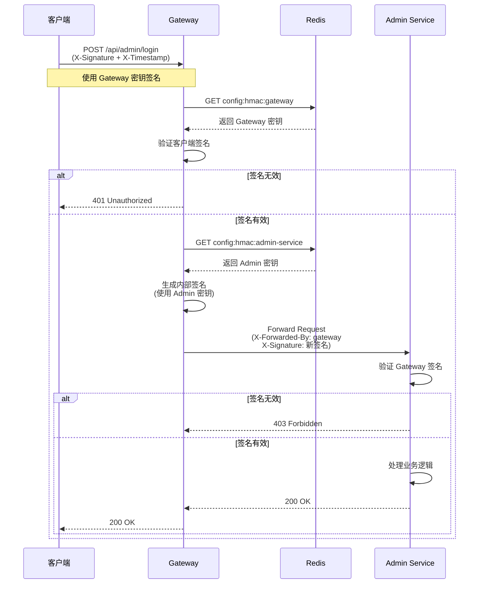
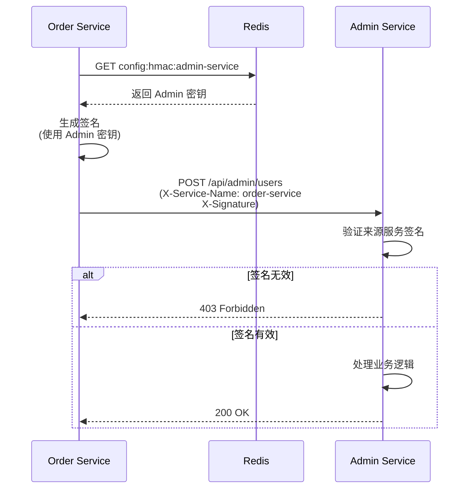

# 微服务架构设计文档

## 📋 目录

- [1. 系统概述](#1-系统概述)
- [2. 技术栈](#2-技术栈)
- [3. 架构图](#3-架构图)
- [4. 核心组件](#4-核心组件)
- [5. 服务通信](#5-服务通信)
- [6. 安全机制](#6-安全机制)
- [7. 数据流](#7-数据流)
- [8. 部署架构](#8-部署架构)
- [9. 高可用设计](#9-高可用设计)
- [10. 监控与日志](#10-监控与日志)

---

## 1. 系统概述

### 1.1 项目背景

本项目是一个基于 **FastAPI** 的微服务架构系统，采用 **API Gateway** 模式，提供统一的服务入口、认证授权、限流保护等功能。

### 1.2 设计目标

- ✅ **统一入口**：所有外部请求通过 Gateway 转发
- ✅ **服务发现**：动态注册和发现微服务实例
- ✅ **安全防护**：HMAC 签名验证、来源白名单、操作审计
- ✅ **高可用**：多级缓存、降级策略、健康检查
- ✅ **可扩展**：支持水平扩展，易于添加新服务

### 1.3 核心服务

| 服务名称 | 端口 | 职责 |
|---------|------|------|
| **Gateway** | 9000 | API 网关、路由转发、HMAC 验证、限流 |
| **Admin Service** | 8001 | 管理后台、用户管理、权限管理、配置管理 |
| **User Service** | - | 用户服务（待开发） |
| **Order Service** | - | 订单服务（待开发） |

---

## 2. 技术栈

### 2.1 后端框架

- **FastAPI** - 高性能异步 Web 框架
- **Uvicorn** - ASGI 服务器
- **Pydantic** - 数据验证和序列化

### 2.2 数据存储

- **MySQL** - 关系型数据库（业务数据）
- **Redis** - 缓存、会话存储、服务注册（主存储）
- **Consul** - 服务发现、KV 存储（降级方案）

### 2.3 服务治理

- **python-consul** - Consul 客户端
- **redis-py** - Redis 客户端（支持集群）
- **httpx** - 异步 HTTP 客户端

### 2.4 安全

- **HMAC-SHA256** - 请求签名验证
- **JWT** - Token 生成（可选）
- **Passlib + Bcrypt** - 密码加密

### 2.5 其他

- **Loguru** - 结构化日志
- **SQLModel** - ORM 框架
- **Pytest** - 测试框架

---

## 3. 架构图

### 3.1 整体架构

```
┌─────────────────────────────────────────────────────┐
│                   客户端层                            │
│  (Web / Mobile / Third-party)                       │
└──────────────────┬──────────────────────────────────┘
                   │
                   │ HTTPS + HMAC 签名
                   ▼
┌─────────────────────────────────────────────────────┐
│                 API Gateway (9000)                   │
│  ┌──────────────────────────────────────────────┐   │
│  │  1. HMAC 验证                                 │   │
│  │  2. 限流保护                                  │   │
│  │  3. 路由转发                                  │   │
│  │  4. 负载均衡                                  │   │
│  │  5. 熔断降级                                  │   │
│  └──────────────────────────────────────────────┘   │
└──────────────────┬──────────────────────────────────┘
                   │
         ┌─────────┴─────────┐
         │                   │
         ▼                   ▼
┌─────────────────┐ ┌─────────────────┐
│ Admin Service   │ │ User Service    │
│ (8001)          │ │ (TBD)           │
│                 │ │                 │
│ • 管理员管理     │ │ • 用户注册       │
│ • 角色权限       │ │ • 用户信息       │
│ • 菜单配置       │ │ • 登录认证       │
│ • 系统配置       │ │                 │
└────────┬────────┘ └────────┬────────┘
         │                   │
         └─────────┬─────────┘
                   │
         ┌─────────┴─────────┐
         ▼                   ▼
┌─────────────────┐ ┌─────────────────┐
│   MySQL         │ │   Redis         │
│   (业务数据)     │ │   (缓存/注册)    │
└─────────────────┘ └────────┬────────┘
                              │
                              ▼
                     ┌─────────────────┐
                     │   Consul        │
                     │   (服务发现)     │
                     └─────────────────┘
```

---

## 4. 核心组件

### 4.1 Gateway 组件

#### 4.1.1 中间件链

```
请求到达 Gateway
    ↓
1️⃣ DynamicCorsMiddleware
   └─ 动态 CORS 配置（从 Redis 读取）
    ↓
2️⃣ HmacMiddleware
   └─ HMAC-SHA256 签名验证
    ↓
3️⃣ RateLimiterMiddleware
   └─ 滑动窗口限流（Redis）
    ↓
4️⃣ 路由转发
   └─ 根据路径匹配服务
    ↓
5️⃣ LoadBalancer
   └─ 轮询/随机/最少连接
    ↓
6️⃣ CircuitBreaker
   └─ 熔断保护
    ↓
转发到后端服务
```

#### 4.1.2 关键模块

| 模块 | 文件 | 功能 |
|------|------|------|
| **HMAC 验证** | `middleware/hmac_middleware.py` | 验证请求签名，防止伪造 |
| **限流器** | `middleware/rate_limiter.py` | 滑动窗口算法，防止滥用 |
| **动态 CORS** | `middleware/dynamic_cors.py` | 从 Redis 读取 CORS 配置 |
| **服务发现** | `services/discovery.py` | 3级缓存（本地→Redis→Consul） |
| **健康检查** | `services/health_checker.py` | 定期刷新服务 TTL |
| **负载均衡** | `services/load_balancer.py` | 多种负载均衡策略 |
| **熔断器** | `services/circuit_breaker.py` | 故障隔离，快速失败 |

---

### 4.2 Admin Service 组件

#### 4.2.1 中间件链

```
请求到达 Admin Service
    ↓
1️⃣ ServiceSourceAuthMiddleware
   ├─ 验证 X-Forwarded-By == "gateway"？ → ✅ 允许
   ├─ 验证服务在 Redis/Consul 注册列表？ → ✅ 允许
   └─ 其他来源 → ❌ 403 Forbidden
    ↓
2️⃣ AuditLogMiddleware
   ├─ 敏感操作？ → 记录审计日志
   └─ 普通操作 → 跳过
    ↓
3️⃣ RateLimiterMiddleware
   ├─ 未超限？ → 允许
   └─ 超限 → 429 Too Many Requests
    ↓
业务逻辑处理
```

---

## 5. 服务通信

### 5.1 通信模式

#### 模式 1：外部客户端 → Gateway → 后端服务

```
Client (携带 HMAC 签名)
    ↓ HTTPS + X-Signature + X-Timestamp
Gateway (验证客户端签名)
    ↓ 验证通过，添加内部签名
Gateway (X-Forwarded-By: gateway + 新签名)
    ↓ HTTP + X-Signature (使用目标服务密钥)
Backend Service (验证 Gateway 签名)
    ↓ 验证通过，处理业务
Response
```

**特点**：
- ✅ **双层 HMAC 验证**：客户端和 Gateway 都需要签名
- ✅ **密钥隔离**：客户端使用 Gateway 密钥，Gateway 使用目标服务密钥
- ✅ **来源标识**：`X-Forwarded-By: gateway` 标记内部请求
- ✅ **前端配置**：前端只需配置 Gateway 的 HMAC Key

---

#### 模式 2：内部服务直接调用（不经过 Gateway）

```
Service A (携带 HMAC 签名)
    ↓ HTTP + X-Signature + X-Service-Name
Service B (验证来源服务签名)
    ↓ 验证通过，处理业务
Response
```

**特点**：
- ✅ **高性能**：不经过 Gateway，减少网络跳转
- ✅ **独立密钥**：每个服务有自己的 HMAC Key
- ✅ **来源验证**：验证 `X-Service-Name` 是否在注册列表
- ✅ **适用场景**：服务间高频调用、内部 RPC

---

### 5.2 HMAC 签名验证流程（优化后）

#### 5.2.1 外部请求流程



**关键改进**：
1. **Gateway 转发时使用目标服务的密钥签名**
   - 之前：❌ Gateway 使用自己的密钥签名
   - 现在：✅ Gateway 使用 `config:hmac:{target_service}` 签名

2. **后端服务使用自己的密钥验证**
   - 之前：❌ Admin 硬编码使用 "gateway" 密钥验证
   - 现在：✅ Admin 使用 `settings.SERVICE_NAME` 对应的密钥验证

3. **密钥匹配逻辑**
   ```python
   # Gateway 转发时
   hmac_key = await redis.get(f"config:hmac:{service_name}")  # 使用目标服务密钥
   signature = generate_hmac(message, hmac_key)
   
   # Admin 验证时
   current_service_name = settings.SERVICE_NAME  # "admin-service"
   hmac_key = await redis.get(f"config:hmac:{current_service_name}")
   is_valid = verify_hmac(signature, message, hmac_key)  # ✅ 密钥匹配
   ```

---

#### 5.2.2 内部服务调用流程



---

### 5.3 密钥管理策略

#### 5.3.1 密钥存储

**存储位置**：
- **主存储**：Redis (`config:hmac:{service_name}`)
- **降级存储**：Consul KV (`config/hmac/{service_name}`)
- **双写策略**：写入时同时写入 Redis 和 Consul

**密钥格式**：
```bash
# Redis Key
config:hmac:gateway          → KYxkFPi0iCsv0MjRuhPupFkicYxyzo2KJ8hvgoNJszk
config:hmac:admin-service    → aaJZyIObHWVE3LD7UTFrndaL98uTpPVcrTcAryu4OjM
config:hmac:user-service     → 4TCKbjrmyB3gbWRNlakl6uCBSo9V9g519sum4D9GS28

# Consul KV Path
config/hmac/gateway
config/hmac/admin-service
config/hmac/user-service
```

#### 5.3.2 密钥生成方式

**方式 1：手动设置（推荐用于生产环境）**
```bash
cd gateway
python setup_independent_hmac.py
```

**方式 2：自动生成（开发环境）**
```python
# Admin Service 启动时自动检查
if not redis.exists(f"config:hmac:{SERVICE_NAME}"):
    new_key = secrets.token_urlsafe(32)
    await redis.set(f"config:hmac:{SERVICE_NAME}", new_key)
```

#### 5.3.3 密钥分配原则

| 服务 | 密钥用途 | 谁持有 |
|------|---------|--------|
| **Gateway** | 验证客户端签名 | 前端、Gateway |
| **Admin Service** | 验证 Gateway 签名 | Gateway、Admin |
| **User Service** | 验证 Gateway 签名 | Gateway、User |

**重要原则**：
- ✅ **对称加密**：发送方和接收方使用同一个密钥
- ✅ **密钥隔离**：每个服务有独立的密钥
- ✅ **前端只用 Gateway 密钥**：前端不需要知道后端服务的密钥

---

### 5.4 零信任安全策略

**原则**：**所有内部服务调用都必须验证来源**

```python
# Admin Service 验证逻辑（优化后）
forwarded_by = request.headers.get("X-Forwarded-By")

if forwarded_by == "gateway":
    # Gateway 转发的请求：验证 HMAC 签名
    current_service_name = settings.SERVICE_NAME  # "admin-service"
    if verify_hmac_signature(request, current_service_name):
        return True  # ✅ 签名验证通过
    else:
        return False  # ❌ 签名无效

# 其他服务直接调用
service_name = request.headers.get("X-Service-Name")
if service_name and service_name in registered_services:
    if verify_hmac_signature(request, service_name):
        return True  # ✅ 已注册服务且签名有效

return False  # ❌ 拒绝访问
```

**registered_services 来源**：
1. **优先**：从 Redis 读取 `service:*:*` 键
2. **降级**：从 Consul 读取服务列表
3. **缓存**：60秒 TTL，减少查询开销

---

## 6. 安全机制

### 6.1 多层防护体系

```
┌──────────────────────────────────────────────┐
│         Admin 服务安全防护                     │
├──────────────────────────────────────────────┤
│                                              │
│  第 1 层：Gateway HMAC 验证                   │
│  ├── 验证客户端请求签名                       │
│  ├── 使用 Gateway 密钥                        │
│  └── 防止伪造请求                             │
│                                              │
│  第 2 层：内部通信 HMAC 验证 ⭐               │
│  ├── Gateway → Backend                       │
│  │   ├── 生成新签名（使用目标服务密钥）       │
│  │   ├── X-Forwarded-By: gateway             │
│  │   └── Backend 验证签名                     │
│  ├── Service → Service                       │
│  │   ├── 使用目标服务密钥签名                 │
│  │   ├── X-Service-Name: {service}           │
│  │   └── 目标服务验证签名                     │
│  └── 密钥隔离，每个服务独立密钥               │
│                                              │
│  第 3 层：来源验证                            │
│  ├── ServiceSourceAuthMiddleware             │
│  │   ├── 验证 X-Forwarded-By (Gateway)      │
│  │   └── 验证 Redis/Consul 注册列表          │
│  └── 拒绝未授权来源                           │
│                                              │
│  第 4 层：操作审计                            │
│  ├── AuditLogMiddleware                      │
│  │   ├── 记录敏感操作                        │
│  │   └── 数据脱敏                            │
│  └── 所有操作可追溯                           │
│                                              │
│  第 5 层：限流保护                            │
│  ├── RateLimiterMiddleware                   │
│  └── 防止滥用                                 │
│                                              │
│  第 6 层：网络隔离                            │
│  ├── Admin 不暴露外网                         │
│  └── 只能通过 Gateway 访问                    │
│                                              │
└──────────────────────────────────────────────┘
```

---

### 6.2 HMAC 密钥管理

#### 6.2.1 密钥生成

**算法**：`secrets.token_urlsafe(32)`
- 密码学安全的随机数生成器
- 生成 43 字符的 URL-safe Base64 编码字符串
- 示例：`KYxkFPi0iCsv0MjRuhPupFkicYxyzo2KJ8hvgoNJszk`

**生成时机**：
1. **手动设置**（推荐生产环境）
   ```bash
   cd gateway
   python setup_independent_hmac.py
   ```

2. **自动生成**（开发环境）
   - Admin Service 启动时检查 Redis
   - 如果密钥不存在，自动生成并存储

#### 6.2.2 密钥存储与同步

**双写策略**：
```python
async def set_hmac_key(service_name: str, key: str):
    # 1. 写入 Redis（主存储）
    await redis.set(f"config:hmac:{service_name}", key)
    
    # 2. 写入 Consul（降级备份）
    consul.set_kv(f"config/hmac/{service_name}", key)
```

**读取策略（支持降级）**：
```python
async def get_hmac_key(service_name: str) -> str:
    # 1. 尝试从 Redis 读取
    key = await redis.get(f"config:hmac:{service_name}")
    if key:
        return key
    
    # 2. 降级：从 Consul 读取
    key = consul.get_kv(f"config/hmac/{service_name}")
    if key:
        # 可选：回写到 Redis
        await redis.set(f"config:hmac:{service_name}", key)
        return key
    
    raise KeyError(f"HMAC key not found for {service_name}")
```

#### 6.2.3 密钥清理

**清理脚本**：
```bash
cd gateway
python cleanup_hmac_keys.py
```

**清理范围**：
- ✅ Redis 中的所有 HMAC 密钥
- ✅ Consul 中的所有 HMAC 密钥
- ⚠️ 清理后服务重启会自动生成新密钥

---

### 6.3 签名生成与验证

#### 6.3.1 签名生成算法

```python
import hmac
import hashlib
import time

def generate_signature(method: str, path: str, body: str, secret_key: str):
    """生成 HMAC-SHA256 签名"""
    timestamp = str(int(time.time()))
    
    # 构建签名字符串
    message = f"{method}\n{path}\n{timestamp}\n{body}"
    
    # 生成签名
    signature = hmac.new(
        secret_key.encode('utf-8'),
        message.encode('utf-8'),
        hashlib.sha256
    ).hexdigest()
    
    return signature, timestamp
```

**签名字符串格式**：
```
{HTTP_METHOD}
{PATH}
{TIMESTAMP}
{BODY}
```

#### 6.3.2 签名验证算法

```python
def verify_signature(signature: str, method: str, path: str, 
                    body: str, timestamp: str, secret_key: str,
                    tolerance: int = 300) -> bool:
    """验证 HMAC 签名"""
    # 1. 检查时间戳（防止重放攻击）
    current_time = int(time.time())
    if abs(current_time - int(timestamp)) > tolerance:
        return False
    
    # 2. 重新计算签名
    message = f"{method}\n{path}\n{timestamp}\n{body}"
    expected_signature = hmac.new(
        secret_key.encode('utf-8'),
        message.encode('utf-8'),
        hashlib.sha256
    ).hexdigest()
    
    # 3. 比较签名（恒定时间比较，防止时序攻击）
    return hmac.compare_digest(signature, expected_signature)
```

**安全措施**：
- ✅ **时间戳验证**：默认容忍 300 秒（5分钟）
- ✅ **恒定时间比较**：防止时序攻击
- ✅ **Body 包含在签名中**：防止篡改请求体

---

### 6.4 前端 HMAC 配置

#### 6.4.1 前端需要配置的参数

```typescript
// frontend/admin-ui/src/api/request.ts
const HMAC_CONFIG = {
  key: 'KYxkFPi0iCsv0MjRuhPupFkicYxyzo2KJ8hvgoNJszk', // Gateway 密钥
  tolerance: 300, // 时间容忍度（秒）
}
```

#### 6.4.2 前端签名生成

```typescript
import CryptoJS from 'crypto-js'

function generateHmacSignature(method: string, path: string, body: any): {
  signature: string
  timestamp: string
} {
  const timestamp = Math.floor(Date.now() / 1000).toString()
  const bodyStr = body ? JSON.stringify(body) : ''
  
  // 构建签名字符串
  const message = `${method}\n${path}\n${timestamp}\n${bodyStr}`
  
  // 生成 HMAC-SHA256 签名
  const signature = CryptoJS.HmacSHA256(message, HMAC_CONFIG.key)
    .toString(CryptoJS.enc.Hex)
  
  return { signature, timestamp }
}
```

#### 6.4.3 请求拦截器

```typescript
import axios from 'axios'

const apiClient = axios.create({
  baseURL: 'http://localhost:9000',
})

// 请求拦截器：自动添加 HMAC 签名
apiClient.interceptors.request.use(config => {
  const { signature, timestamp } = generateHmacSignature(
    config.method!.toUpperCase(),
    config.url!,
    config.data
  )
  
  config.headers['X-Signature'] = signature
  config.headers['X-Timestamp'] = timestamp
  
  return config
})
```

**重要提示**：
- ✅ **前端只使用 Gateway 密钥**
- ❌ **前端不需要知道后端服务的密钥**
- ✅ **所有请求（包括登录）都需要签名**

---

### 6.5 安全最佳实践

#### 6.5.1 密钥轮换

**建议周期**：每 90 天轮换一次密钥

**轮换步骤**：
1. 生成新密钥
2. 同时保留旧密钥（双密钥期，7天）
3. 更新所有服务的配置
4. 删除旧密钥

#### 6.5.2 密钥存储安全

**生产环境建议**：
- ✅ 使用 Vault 或 AWS Secrets Manager 存储密钥
- ✅ 限制 Redis/Consul 访问权限
- ✅ 启用 Redis TLS 加密传输
- ❌ 不要将密钥硬编码在代码中
- ❌ 不要将 `.env` 文件提交到 Git

#### 6.5.3 监控与告警

**需要监控的指标**：
- HMAC 验证失败次数（可能表示攻击）
- 时间戳过期请求数量（可能表示时钟不同步）
- 密钥读取失败次数（Redis/Consul 故障）

**告警阈值**：
- HMAC 验证失败率 > 5% → 立即告警
- 密钥读取失败 > 3次/分钟 → 警告

---

## 7. 数据流

### 7.1 服务注册流程

```
Admin Service 启动
    ↓
生成固定服务 ID (MD5: name+ip+port)
    ↓
注册到 Gateway API
    ↓
Gateway 清理旧实例
    ↓
存储到 Redis (TTL: 30s)
    ↓
注册到 Consul (可选)
    ↓
启动 HealthChecker (每10秒刷新TTL)
```

---

### 7.2 服务发现流程

```
Gateway 接收请求
    ↓
查询本地缓存 (优先)
    ↓ 未命中
查询 Redis (主要来源)
    ↓ 失败
查询 Consul (降级方案)
    ↓ 失败
返回 503 Service Unavailable
```

---

## 8. 部署架构

### 8.1 开发环境

```
┌─────────────────────────────────────┐
│         开发机器 (Windows)           │
├─────────────────────────────────────┤
│                                     │
│  Gateway (localhost:9000)           │
│  Admin Service (localhost:8001)     │
│  MySQL (localhost:3306)             │
│  Redis (localhost:6379)             │
│  Consul (localhost:8500)            │
│                                     │
└─────────────────────────────────────┘
```

### 8.2 生产环境（推荐）

```
┌──────────────────────────────────────────────┐
│              负载均衡器 (Nginx)               │
└──────────────────┬───────────────────────────┘
                   │
         ┌─────────┴─────────┐
         ▼                   ▼
┌─────────────────┐ ┌─────────────────┐
│  Gateway #1     │ │  Gateway #2     │
│  (高可用)        │ │  (高可用)        │
└────────┬────────┘ └────────┬────────┘
         │                   │
         └─────────┬─────────┘
                   │
         ┌─────────┴─────────┐
         ▼                   ▼
┌─────────────────┐ ┌─────────────────┐
│ Admin Service   │ │ User Service    │
│ (多实例)         │ │ (多实例)         │
└────────┬────────┘ └────────┬────────┘
         │                   │
         └─────────┬─────────┘
                   │
         ┌─────────┴─────────┐
         ▼                   ▼
┌─────────────────┐ ┌─────────────────┐
│  MySQL Cluster  │ │  Redis Cluster  │
│  (主从复制)      │ │  (哨兵模式)      │
└─────────────────┘ └────────┬────────┘
                              │
                              ▼
                     ┌─────────────────┐
                     │  Consul Cluster │
                     │  (3节点)         │
                     └─────────────────┘
```

---

## 9. 高可用设计

### 9.1 多级缓存策略

```
服务发现查询优先级：

1️⃣ 本地缓存 (最快，0ms)
   └─ TTL: 60秒
   
2️⃣ Redis (主要来源，~5ms)
   └─ 存储所有服务实例
   
3️⃣ Consul (降级方案，~10ms)
   └─ Redis 故障时使用
   
4️⃣ 返回错误 (最后手段)
   └─ 503 Service Unavailable
```

### 9.2 降级策略

**场景 1：Redis 故障**
```python
# 自动切换到 Consul
if redis_failed:
    services = consul.get_services()
```

**场景 2：Consul 故障**
```python
# 使用本地缓存
if consul_failed:
    services = local_cache.get()
```

---

## 10. 监控与日志

### 10.1 日志规范

**日志级别**：
- `DEBUG` - 调试信息（开发环境）
- `INFO` - 正常操作（服务启动、请求处理）
- `WARNING` - 警告信息（降级、重试）
- `ERROR` - 错误信息（异常、失败）

---

### 10.2 关键指标

**Gateway 指标**：
- 请求总数 / QPS
- 平均响应时间
- 错误率（4xx/5xx）
- 限流触发次数
- 熔断器状态

**Admin Service 指标**：
- 服务注册数
- 健康检查成功率
- 审计日志数量
- 数据库连接池使用率

---

**文档版本**: v2.0  
**最后更新**: 2026-04-13  
**更新内容**: 
- 优化 HMAC 密钥验证逻辑（Gateway 使用目标服务密钥签名）
- 实现 Redis + Consul 双写策略，支持降级读取
- 明确前端 HMAC 配置规范（只使用 Gateway 密钥）
- 补充完整的签名生成与验证算法
- 添加密钥管理和安全最佳实践
